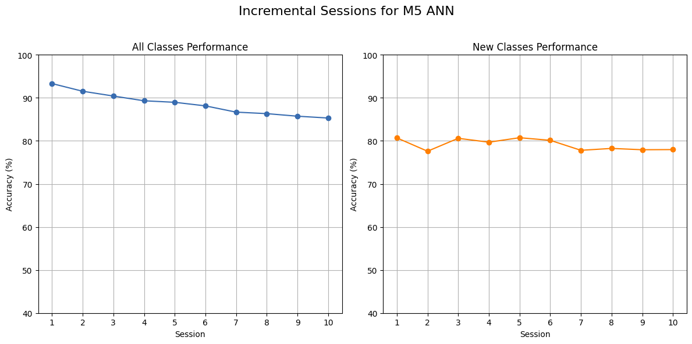
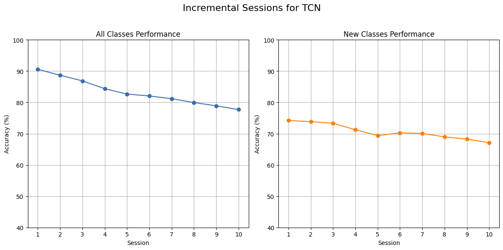

# NeuroBench: MSWC Few-Shot Incremental Learning (FSCIL) Reproducible

To reproduce the NeuroBench: A Framework for Benchmarking Neuromorphic Computing Algorithms and Systems(https://arxiv.org/abs/2304.04640): 

1. Open the `M5_ANN_Reproduction_plots.ipynb` and follow through the code. This notebook reproduces the red (non-dashed) curve (Proto-typical M5 ANN) as shown in Figure 3.  The plots are reproduced close to the orginal on a single run.  
2. New algorithm variant Temporal Convolutional Network (TCN) is used run the benchmark. Open the `TCN_training_less_params.ipynb` notebook where TCN is trained with 78,088 parameters which is considerably less than the parameters used in ANN.
3. To produce the incremental sessions accuracy plots like in Fig. 3 for TCN, open `TCN_FSCIL_Plots.ipynb` notebook. Run through all the code and we can see that high accuracy is achieved which is mostly similar to ones in Fig. 3.
